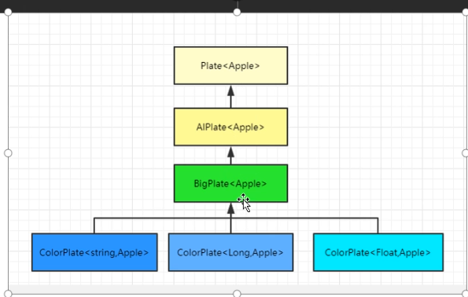
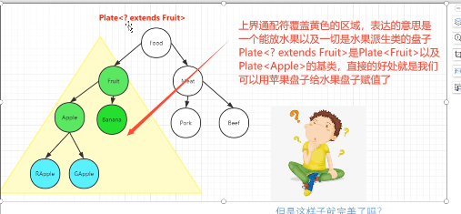
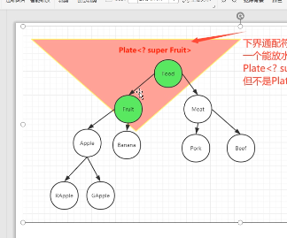
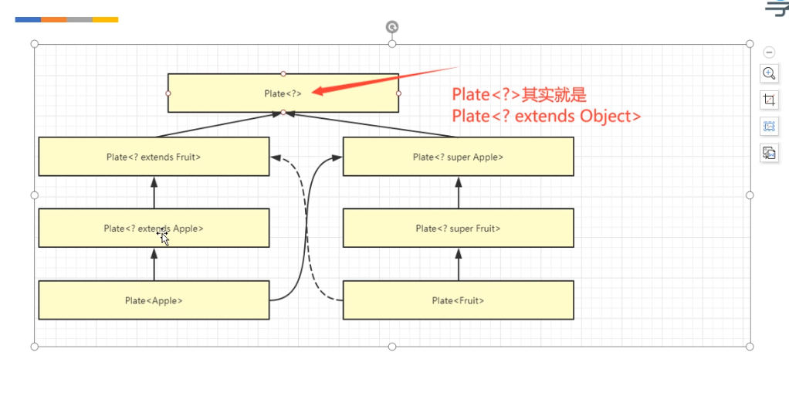

### 泛型

#### 泛型是什么
java 泛型是JDK5引入的一中 “参数化类型”特性
#### 为什么使用泛型，使用泛型好处
1、代码更健壮（只要编译器没有警告，运行时就不会出现 ClassCastException）
2、代码更简洁（需用强转）
3、代码更灵活，复用 （例如：只要实现了Comparator接口都可以使用Sort 方法）
##### 参数化类型
把类型当作参数一样传递
<数据类型>只能时引用类型（泛型的副作用）
例如：
Plate<T>   中 ‘T’称为类型参数
Plate<Banana> 中‘Banana’称为实际类型参数
“Plate<T>” 整个称为泛型类型
“Plate<Banana>”整个称为参数化类型ParameterizedType

#### 泛型的三种使用
1、泛型接口 (在接口名后面增加 <T>)
例：
```
    public interface Plate<T>{
    }
```
2、泛型类( 在类名后面 增加 <T>)
例-1：未知 泛型类的具体类型
```

public class AiPlate<T> implements Plate<T>{
}
```
例-2：已知 泛型类的具体类型
```
 public class ApplePlate implements Plate<Apple>{
 }
```

3、泛型方法(可见修饰符 和 返回值之间 增加 <T>)
例：
```
 public <T> AiPlate<T> getAiPlate( ){
        return new AiPlate<T>();
 }
```
#### 泛型的限定
 1、如果泛型 有多个限定的类型变量是范围中列出的所有类型的子类型。如果范围之一是类，则必须首先指定类
 2、泛型 单继承（可实现多个接口，只能继承一个类）

 例-3
 ```
 static class A{}
 static class A1{}
 interface B{}
 interface C{}
 static D1<T extends A &B &C>{ //成功
 }
 static D2<T extends  B & A & C>{ //失败
 }

//单继承
static D3<T extends A & A1 & B& C>{//失败
}
 ```

 #### 泛型本质
 由此可见运行时获取的类型是完全一致的，泛型类型被擦除掉，擦除后只留下了原始类型，这里也就是 ArrayList
 2、桥方法
 泛型擦除的残留
 泛型类中独有的标记，普通类没有，jdk5才加入，标记了定义时的成员签名（泛型参数列表，参数类型，返回值等）对方法参数和返回值进行描述
 3、泛型类的擦除 -- 擦除其实在类常量池里面保留了泛型信息


 ####java泛型的原理？ 什么是泛型擦除机制？
 java的泛型是jdk5新引入的特性，为了向下兼容，虚拟机其实是不支持泛型，所以java实现的是一中
 伪泛型机制，就是说Java在编译期擦除了所有的泛型信息，这样java就不需要产生新的类型到字节码，
 所有的泛型类型最终都是一种原始类型，在java运行时根本就不存在泛型信息

 #### java编译器具体是如何擦除泛型的
1、检查泛型类型，获取目标类型
2、擦除类型变量，并替换为限定类型
   2.1、如果泛型类型的类型变量没有限定<T>,则用Object作为原始类型
   2.2、如果有限定类型<T extends XClass>,则用XClass作为原始类型
   2.3、如果有多个限定(T extends XClass1&XClass2),则使用第一个边界XClass1作为原始类
3、有必要时插入类型转换以保持类型安全
4、生成桥方法以在扩展时保持多态性
```
（例如：
    public class AiPlate<T extends Comparable<T>>  implements Plate<T>{
        public AIPlate() { /* compiled code */ }
        public void set(Comparable t) { /* compiled code */ }

        public Comparable get() { /* compiled code */ }

    	    @Overide
    	    public synthetic bridge get(){}

    	    @Overide
    	    public synthetic bridge set(Object t){ //这里就是桥方法，
    	        set((Comparable)t) //这里调用的就是上面的set(Comparable t)方法；保证了java的多态性
    	     }

    	 public java.lang.String toString() { /* compiled code */ }
    }

在“字节码-class” 中会生成 桥方法，来保证java的多态
）
```

#### 使用泛型以及泛型参数带来的影响（副作用）
1、泛型类型变量不能使用基本数据类型（因为：比如：ArrayList<int>当类型擦除后，Arraylist的原始类中的类型变量（T）替换成Object，但Object类型不能存放int类型）
2、不能使用instanceOf运算符
ArrayList<String> strings=new ArraList<>{}
 if (strings instanceof ArrayList<?>){ // 成立 【？是通配符 未知】}
 if (strings instanceof ArrayList<String>){//不成立； 因为擦除ArrayList<String>后 String信息会丢失。}
3、泛型在静态方法和静态类中的额问题
  因为泛型类中的泛型参数的实例化是在定义泛型类型对象（比如Array list《Integer》的时候指定的，
  而静态成员是不需要使用对象调用的，所有对象都没有创建，如何确定这个泛型参数是什么）
  public static <T> T test1(T t){return t} 可以（因为这里是泛型方法，调用的时候才确定泛型类型的）
  public static T one；//不可
  public static T test(T t){}//不可
4、泛型类型中的方法冲突
    因为擦除后两个equals方法变成一样的了

5、没有办法创建泛型实例（）因为类型不确定
    public static<E> void append(List<E> list){
        //不可
    	E e=new E();
    	list.add(e)
    }
    public static <E> void append(List<E> list,Class<E>class){
    //可行；通过反射创建
    E elem=class.newInstance();
    list.add(elem)
    }
6、没有泛型数组（ArrayStoreException）
    因为数组的协变，擦除后就没有办法满足数组斜边的原则
    例如：
    如果：Apple extends Fruit
    那么：Apple[] 父类是fruit[]
    这就是 数组的协变
    如果加入泛型后，由于擦除机制，运行时将无法知道数组的类型

#### 泛型 继承 和子类型
给定两个类A和B ，不论A和B是什么关系，MyClass<A>和MyClass<B>没有任何关系。他们的公共对象是Object

继承：
ColorPlate 继承自 BigPlate 继承自 AiPlate 继承自 Plate；只要 T类型一样，他们的继承关系是成立的
```
//这个继承关系是 成立的。
Plate<Apple> apple01=new AiPlate<Apple>()；
Plate<Apple> apple02=new BigPlate<Apple>();
Plate<Apple> apple02=new ColorPlate<Apple>();
```



#### 通配符
作用 ：两个继承类 A 是B的子类，那么 泛型类：MyClass<A>和MyClass<B>没有任何关系。为了让这两个泛型类（MyClass<A>和MyClass<B>）产生关系，使用通配符 ‘？ extends|| ？ super || ？’
例
```
public Plate<? extends Fruit> getSnack(Plate<Apple> applePlate){
    Plate<? extends Fruit> plate=applePlate;
    return plate;
}

```
##### 上界通配符 ？ extends
上界通配符 覆盖黄色区域，表达意思是 一个能放水果以及一切是水果派生类的盘子；
Plate<? extends Fruit>是 Plate<Fruit>和Plate<Apple>的基类，直接的好处就是我们可以用苹果盘子给水果盘子赋值

###### ？extends 后遗症
```
public Plate<? extends Fruit> getSnack(Plate<Apple> applePlate){
    Plate<? extends Fruit> plate=applePlate;
    //不能存放任何元素
    plate.add(new Apple());
    plate.add(new Banana());
    
    return plate;
}


Plate<? extends Fruit> plate=xiaoMing.getSnack(applePlate);
// 这个时候 小红 从盘子里拿苹果吃，不可以了
xiaoHong.eat(plate.get());
//实际上
plate.get();返回的是 Fruit||Object；就是不知道 是那个具体的水果（因为擦除）

```

#### 下界通配符 ？ super
下界通配符覆盖的红色区域，这里表达的意思是就是一个能放水果以及一切水果基类的盘子；
Plate<? super Fruit> 是 Plate<Fruit>的基类但不是Plate<Apple>的基类


###### ？super 后遗症
可以把Plate<Fruit>以及它的基类Plate<Food> 转成Plate<? super Fruit>,它可以存储数据，
但是取出后泛型信息丢失，只能用Object存放；
```
public static void sceen03(){
    Plate<? super Fruit> lowerFruitPlate=new AiPlate<Food>();
    lowerFruitPlate.add(new Apple());
    lowerFruitPlate.add(new Banana());
    //
    Fruit fruit=lowerFruitPlate.get();//报错
    Object object=lowerFruitPlate.get();//成功
}
```

#### ？ 非限定通配符
是一个泛型类型，？ 未知
等价于 Plate<? extends Object>;
既不能读，也不能写
例如：
```
public void sceeon05(){
    Plate<?> plate=new AiPlate<Apple>
    plate.add(new Apple);//报错（因为未知，标记的Cap#1 无法匹配到T）
    Fruit fruit=plate.get();//报错（因为具体类型未知，无法赋值给Fruit的类对象）
   //但是下面可以
   plate.toString();
   plate.add(null);
   Object object=plate.get();
}

```


作用： （检查泛型的类型）


#### ? 和 泛型<T> 有什么关系
通过使用 限定限定通配符，可以让泛型 转型更灵活。

#### Java泛型PECS原则
PECS即Producer（生产者） extends Customer（消费者） super
如果只需要从集合中获取类型T，使用 <? extends T>通配符---生产者
如果只需要将类型T放到集合中，使用<? super T>通配符------消费者
如果既要获取又要放置元素，则不适用任何通配符，例如：List<Apple>
<?> 既不能存也不能取

